# 在线教学直播平台

基于 Spring Boot 和 [SRS](https://github.com/ossrs/srs)

## 平台功能

* 视频直播
* 在线聊天
* 直播提醒
* 作业上传和批改

## 常见问题解答

* https://github.com/zhang564-code/live/wiki
* https://github.com/jerryshell/live-teaching-platform/issues?q=

## 参考此项目需要你已经掌握以下内容

* Spring Boot/Spring 依赖注入/Spring MVC
* Spring Data JPA
* HTML/CSS/JS
* Thymeleaf
* Linux 基本操作
* ~Nginx 配置~（最新版的 SRS 已经解决跨域问题，不需要 Nginx 了）

## 平台界面

### 登录和注册

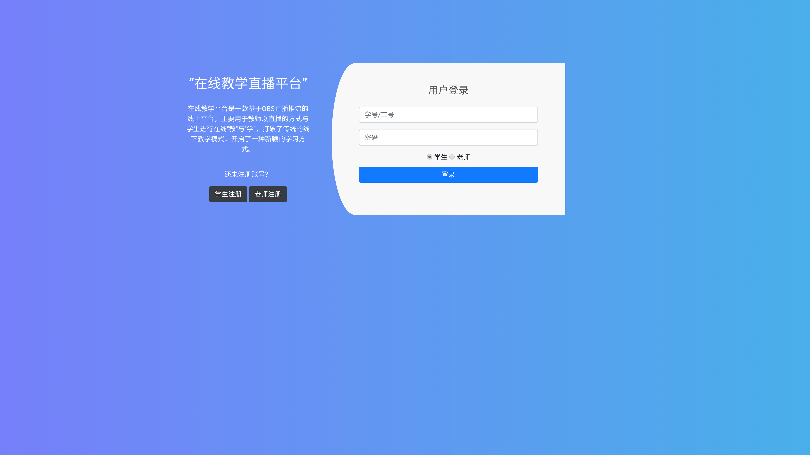

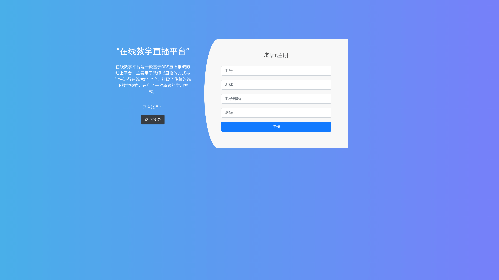

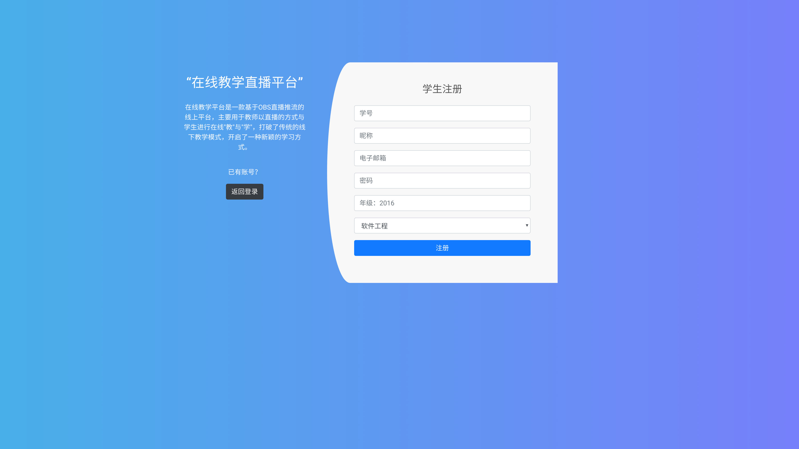

### 首页

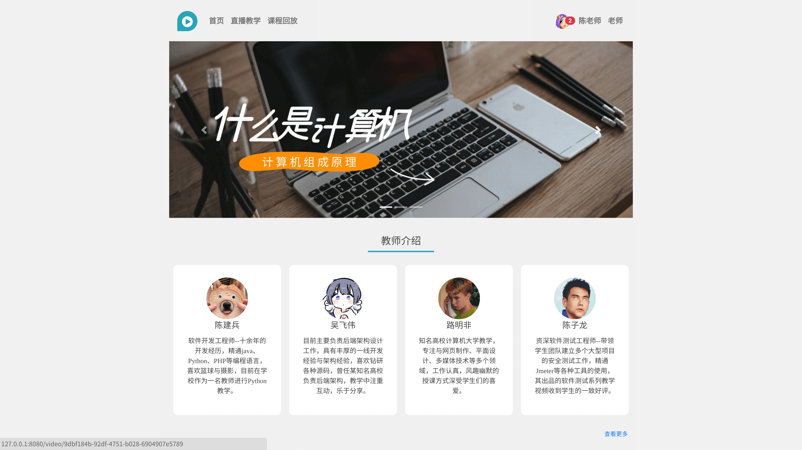

### 直播列表

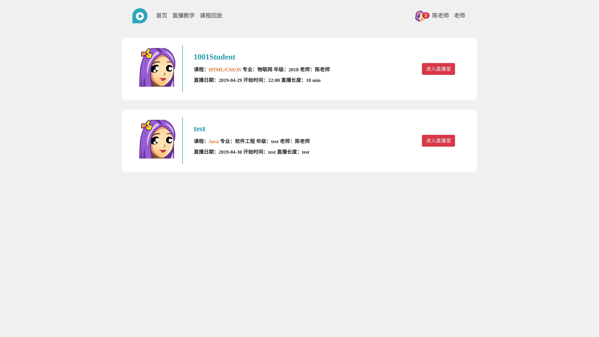

### 直播页面

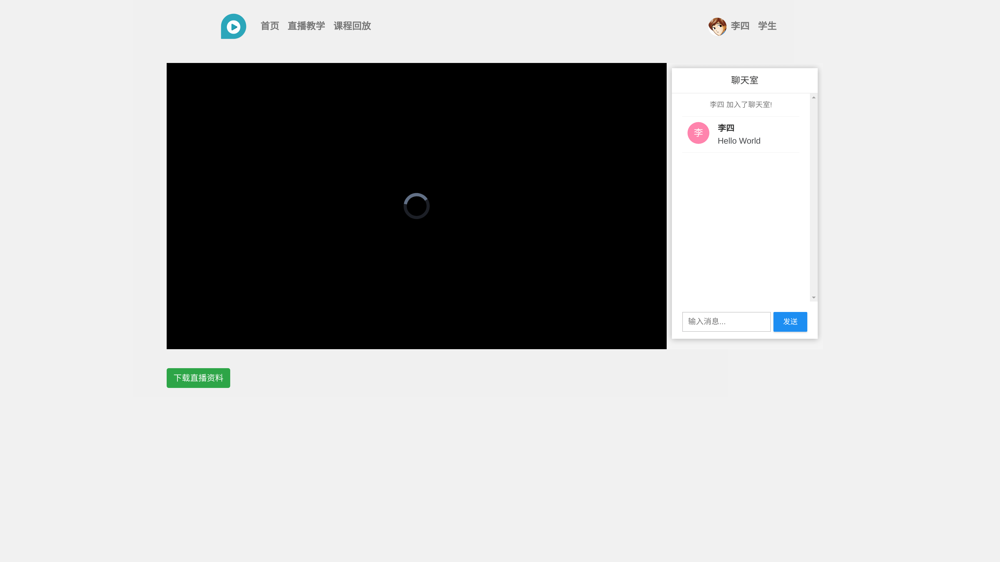

### 课程回放列表

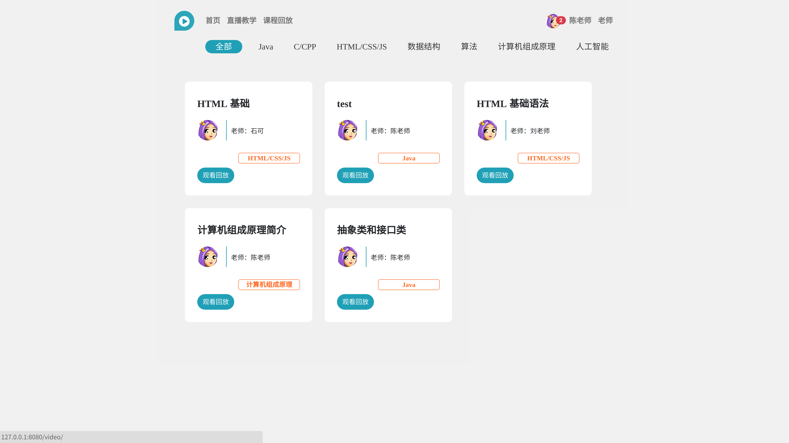

### 观看回放页面

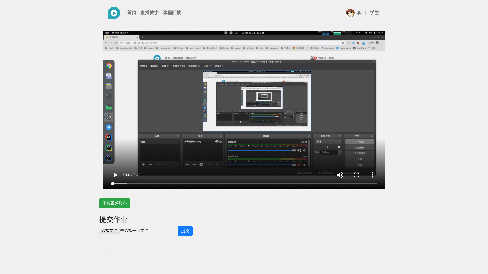

### 老师个人信息

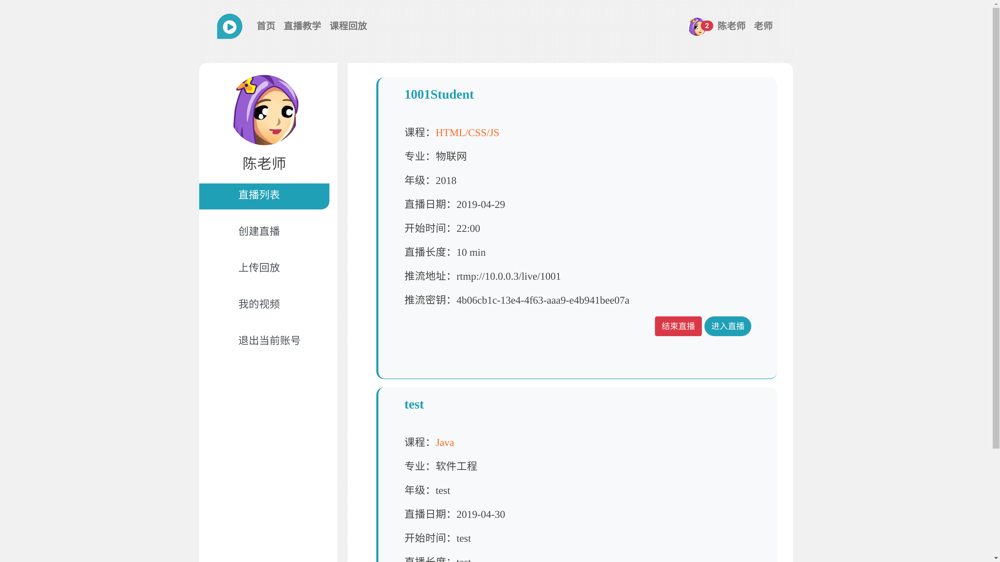

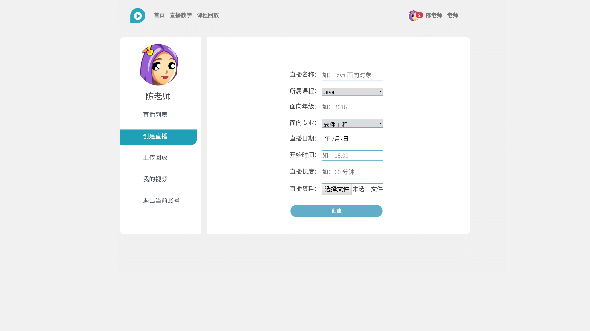

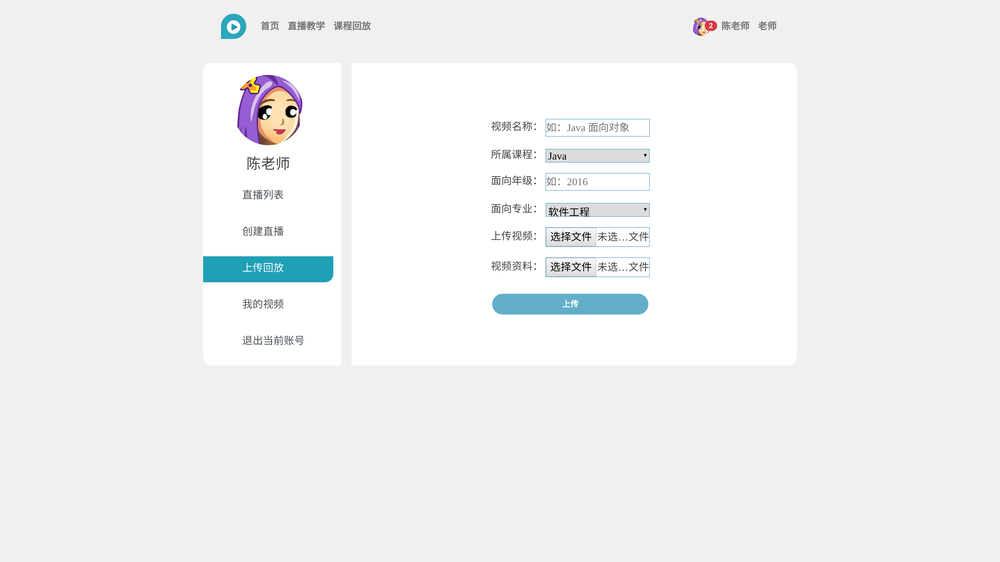

### 学生个人信息

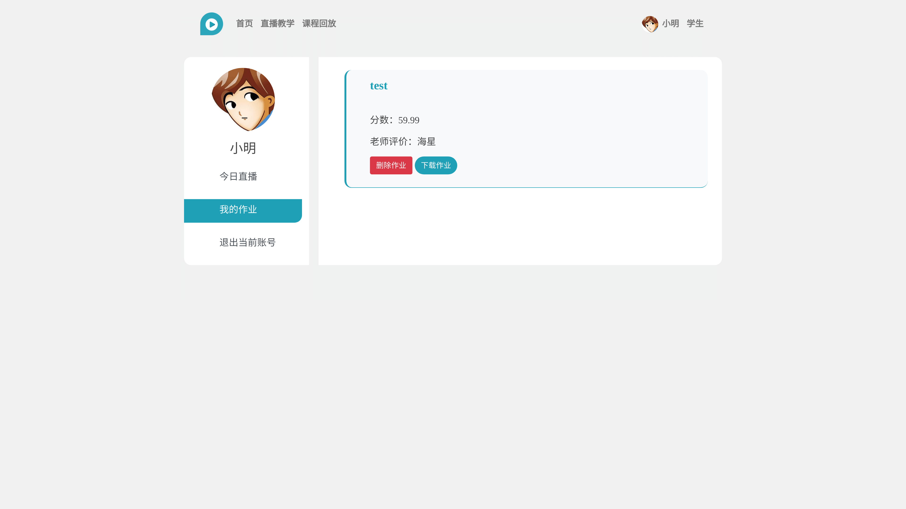

### 老师批改作业

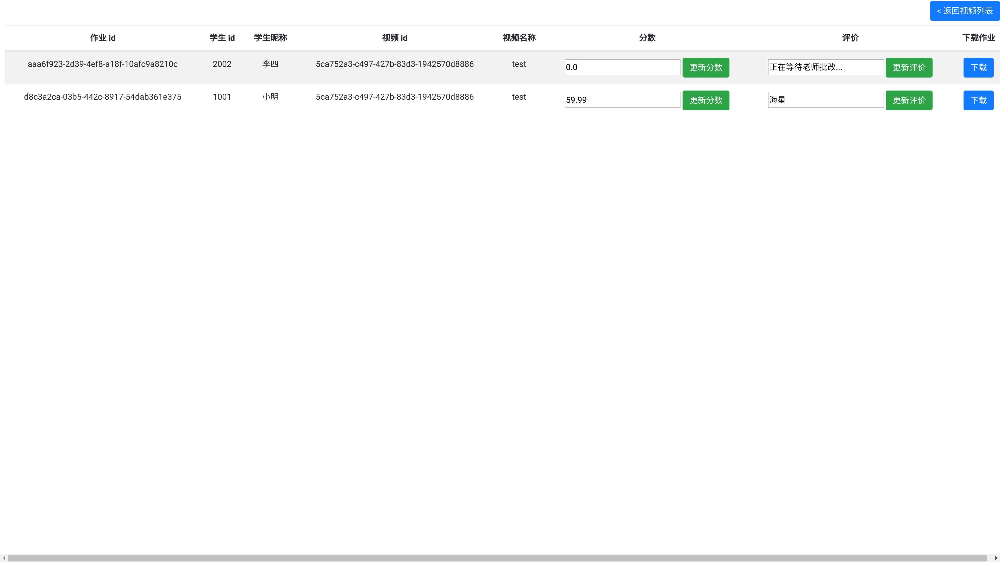
